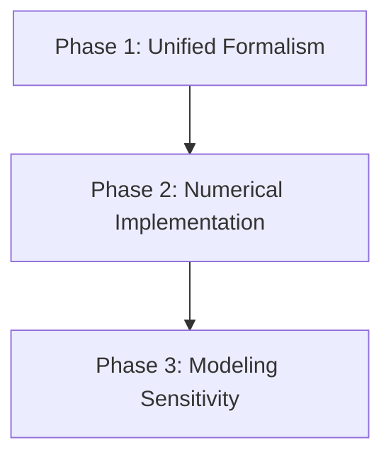

# Research Roadmap: Gravitational Radiation from First-Order Phase Transitions

## Overview

This project aims to construct improved gravitational wave (GW) spectra for electroweak first-order phase transitions by consistently combining three primary sources: bubble collisions, sound waves, and magnetohydrodynamic turbulence. The central research goal is to quantify how variations in modeling assumptions—specifically wall velocity and sound shell thickness—impact the predicted signal's position in the frequency-energy density plane $(f, \Omega_{GW})$, providing a clearer mapping for future detectors like LISA and PTA.

## Research Objectives

- **ANAL-01**: Derive improved GW spectra combining bubble collisions, sound waves, and turbulence
- **ANAL-02**: Establish new analytical formula for the improved GW spectrum
- **NUMR-01**: Implement code to compute GW spectra and compare with benchmarks
- **NUMR-02**: Quantify signal movement in (f, ω_GW) plane under different modeling assumptions

---

## Phase 1: Unified Formalism for GW Sources

**Goal:** Derive a consistent theoretical framework combining bubble collisions, sound waves, and turbulence, resulting in a new analytical formula for the combined GW spectral density.

- **Status:** Complete (2026-03-17)
- **Primary Objectives:** ANAL-01, ANAL-02
- **Contract Coverage:** Consistent combination of sources, New analytical formula (deliv-gw-formula)
- **Key Anchors:** Hindmarsh et al. (2015) (Ref-Hindmarsh2015)
- **Dependencies:** None

**Plans:** 2 plans
- [ ] 01-01-PLAN.md -- Unified Stress-Energy Tensor and Spectral Density
- [ ] 01-02-PLAN.md -- Verification and Error Budget

**Success Criteria:**
1. Derivation of a unified spectral density equation $d\Omega_{GW}/d\ln f$ that incorporates bubble, sound, and turbulence kernels.
2. The unified formula reproduces known single-source results (e.g., envelope approximation for bubbles) in the appropriate decoupling limits.
3. Dimensional analysis confirms the correct mass-dimension of all terms and coupling constants.
4. Physical consistency check: The integrated energy density does not exceed the total latent heat available from the phase transition.

---

## Phase 2: Numerical Implementation and Benchmark Validation

**Goal:** Develop and validate a numerical code for computing the improved GW spectra, ensuring accuracy against established benchmarks.

- **Status:** Pending
- **Primary Objectives:** NUMR-01
- **Contract Coverage:** Code for generating improved GW spectra (deliv-gw-code), Comparison plots (deliv-gw-spectra-plots)
- **Key Anchors:** Hindmarsh et al. (2015) numerical benchmarks
- **Dependencies:** Phase 1

**Plans:** 2 plans
- [ ] 02-01-PLAN.md -- Core Numerical Implementation
- [ ] 02-02-PLAN.md -- Benchmark Validation and Redshifted Analysis

**Success Criteria:**
1. Numerical implementation of the Phase 1 formula converges over the frequency range $10^{-9}$ Hz to $10^{3}$ Hz.
2. Direct numerical comparison shows agreement within 5% of Hindmarsh (2015) results for the sound-wave dominant regime.
3. Code correctly propagates the source-frame spectrum to present-day observables $(f, \Omega_{GW})$ accounting for cosmic expansion.
4. Validation of the turbulence kernel implementation against spectral decay benchmarks.

---

## Phase 3: Modeling Sensitivity and Signal Displacement

**Goal:** Quantify the displacement of the GW signal in the $(f, \Omega_{GW})$ plane resulting from different physical modeling assumptions.

- **Status:** Pending
- **Primary Objectives:** NUMR-02
- **Contract Coverage:** Comparison plots showing signal movement (deliv-gw-spectra-plots), Quantification of modeling impacts
- **Key Anchors:** Wall velocity $v_w$ models, Sound shell approximations
- **Dependencies:** Phase 2

**Plans:** 2 plans
- [ ] 03-01-PLAN.md -- Parameter Sweeps and Peak Extraction
- [ ] 03-02-PLAN.md -- Sensitivity Analysis and Displacement Mapping

**Success Criteria:**
1. Generation of displacement maps in the $(f, \Omega_{GW})$ plane showing how the signal peak moves as $v_w$ varies from $0.1$ to $1.0$.
2. Comparison of "thin-shell" vs "thick-shell" sound shell models reveals systematic shifts in peak frequency and spectral slope.
3. Quantification of the "signal drift" vector for varying turbulence decay rates.
4. Final results tabulated as a sensitivity matrix for modeling parameters, suitable for inclusion in the project publication.

---

## Phase Dependencies

## Risk Register

| Phase | Top Risk | Probability | Impact | Mitigation |
|-------|---------|:-:|:-:|-----------|
| 1 | Inconsistency in turbulence/sound wave combination | MEDIUM | HIGH | Use linear superposition as baseline; identify non-linear cross-terms |
| 2 | Numerical instability at high frequency | LOW | MEDIUM | Implement adaptive integration steps; verify against asymptotic limits |
| 3 | Signal movement is smaller than numerical error | LOW | HIGH | Tighten convergence criteria in Phase 2; focus on peak frequency ratios |

## Backtracking Triggers

- **Phase 2 Validation:** If numerical results deviate from Hindmarsh (2015) by > 10% in the sound-wave limit, revisit the Phase 1 derivation of the sound-wave kernel.
- **Phase 3 Analysis:** If the signal peak position is insensitive to wall velocity changes, re-evaluate the wall velocity modeling assumptions and the resolution of the $(f, \Omega_{GW})$ grid.

---
_Last updated: 2026-03-17_
